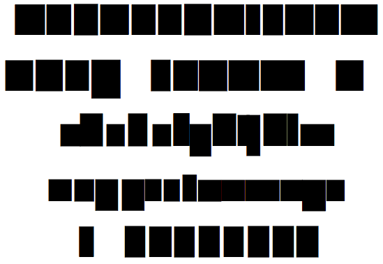

# Disguiser.glyphsFilter

This is a plugin for the [Glyphs font editor](http://glyphsapp.com/) by Georg Seifert. It replaces the layer with a rectangle covering its bounds. This is useful for sharing files that contain sensitive designs. If invoked on a partial selection, the Disguiser will place a rectangle only over the selected parts.

Installation of this filter will add the menu item *Filter > Disguiser*. You can set a keyboard shortcut in System Preferences.

### Installation

1. Download the complete ZIP file and unpack it, or clone the repository.
2. Double click the .glyphsFilter file. Confirm the dialog that appears in Glyphs.
3. Restart Glyphs

### Usage Instructions

1. Open a glyph in Edit View, or select any number of glyphs in Font or Edit View.
2. Choose *Filter > Disguiser*.

More importantly, you can use it as a custom parameter in an instance:

	Property: Filter
	Value: Disguiser;

At the end of the parameter value, you can hang `exclude:` or `include:`, followed by a comma-separated list of glyph names. This will apply the filter only to the included glyphs, or the glyphs not excluded, respectively.

### Requirements

The plugin was tested in Glyphs 2.2 on OS X 10.11. I have no idea if it works on older setups.

### License

Copyright 2015 Rainer Erich Scheichelbauer (@mekkablue).
Based on sample code by Georg Seifert (@schriftgestalt).

Licensed under the Apache License, Version 2.0 (the "License");
you may not use this file except in compliance with the License.
You may obtain a copy of the License at

http://www.apache.org/licenses/LICENSE-2.0

See the License file included in this repository for further details.
